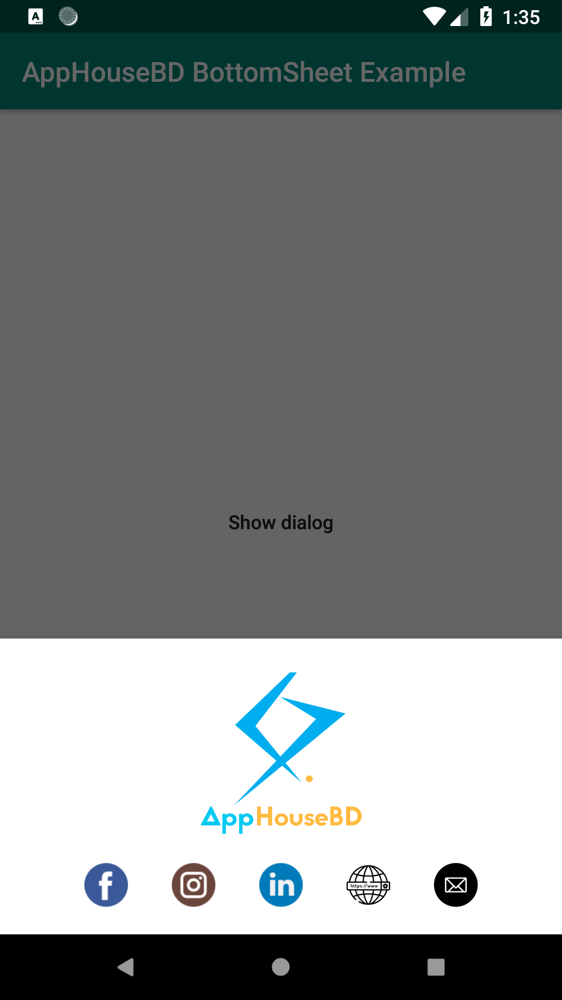
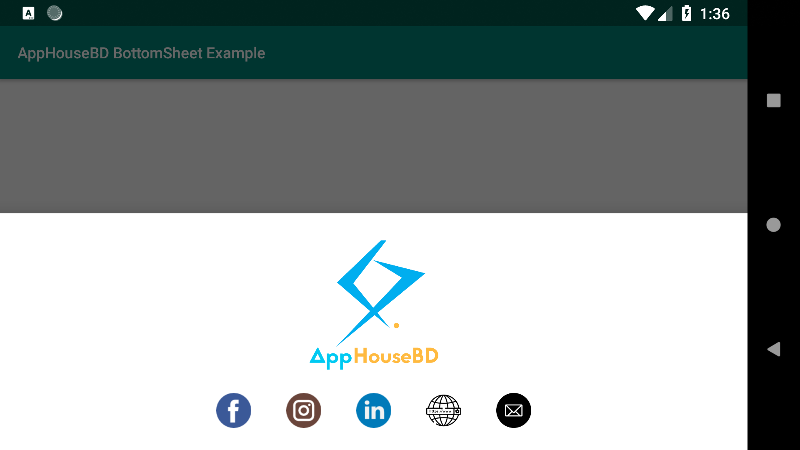

# apphousebd_bottom_dialog

## Intoduction

This is a bottom sheet dialog library made for ["AppHouseBD"](https://apphousebd.com). Here all the social media links of the company is added and linked.

## Implementation (Android Studio)

## Gradle

Insert the following dependency to `build.gradle` file of your project app folder.

    dependencies {
        ...
        implementation 'com.github.AsifShaafi:apphousebd_bottom_dialog:LATEST_JITPACK_VERSION'
    }
    
Add the following to your root/top level `build.gradle` file at the end of repositories

    allprojects {
        repositories {
            ...
            maven { url 'https://jitpack.io' }
        }
    }
    

## Usage

For example, see the app folder where it is implemented on a button click

Screen shots:

    Landscape:

##### Code

    kotlin: 

        AppHouseBDBottomSheetDialog().showDialog(SupportFragmentManager/FragmentManager, [tag(optional)])
    
    Java:
        
        AppHouseBDBottomSheetDialog appDialog = new AppHouseBDBottomSheetDialog();
        appDialog.showDialog(getSupportFragmentManager(), "AppHouseBD");
    
    
## License & Copyright

Copyright &copy; 2018 AppHouseBD

Licensed under the [Apache License 2.0](LICENSE)
